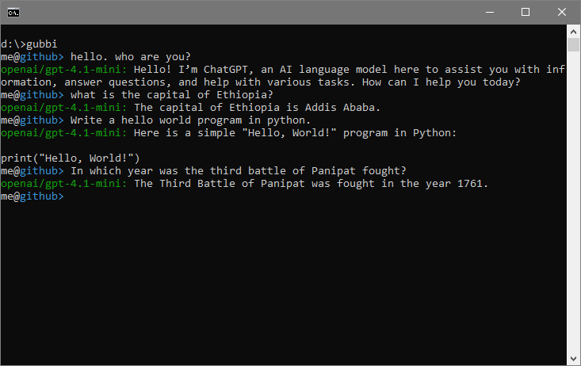

[](https://paypal.me/prahladyeri)
[](https://x.com/prahladyeri)

# gubbi

*Minimalist LLM chatbot 🐤*

# Installation

	pip install gubbi
	
# Usage

	gubbi -a # add provider/model
	gubbi -c # chat
	
# Commands

```plaintext
	#help => List commands
	#exit => Quit chat
	#use <provider> => Switch provider
	#model <model_name> => Switch model
	#attach <path> => Attach a file
	#clear => Clear context
	#save => Save current chat
	#load <filename> => Load an earlier chat
	#models <filename> => List all models
	#providers <filename> => List all providers	
```

# Screenshot

